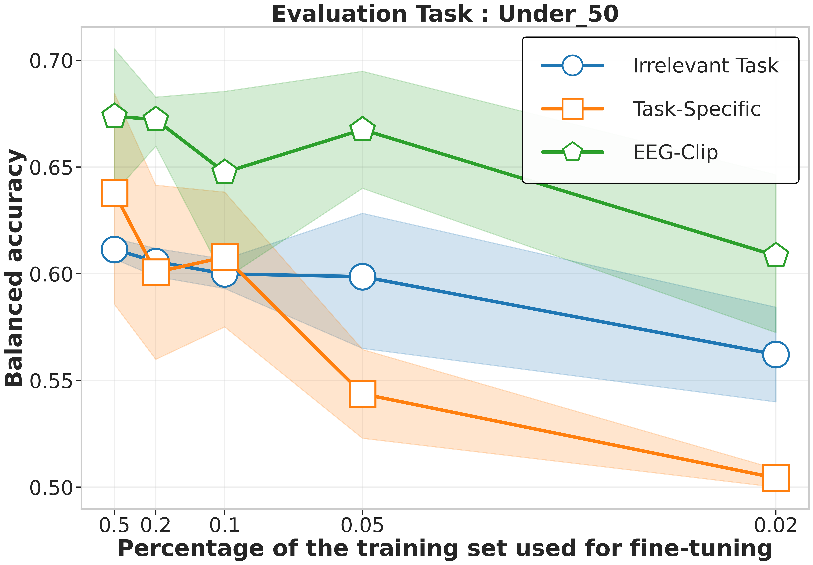

# EEGClip: Learning EEG Representations from Natural Language Descriptions

EEGClip is a contrastive learning framework that aligns EEG time series data with their corresponding clinical text descriptions in a shared embedding space. Inspired by CLIP (Contrastive Language-Image Pretraining), EEGClip enables versatile EEG representation learning for improved pathology detection and other downstream tasks in low-data regimes.

<p align="center">
  
</p>


## Quick Start

### Installation

```bash
# Clone the repository
git clone https://github.com/tidiane-camaret/EEGClip.git
cd EEGClip

# Install dependencies
pip install -r requirements.txt
pip install -e .
```

*Note: You may need to modify paths to datasets and pretrained models in `configs/preprocess_config.py`*

### 1. Preprocessing

Generate text embeddings using the ClinicalBERT model:

```bash
python scripts/text_preprocessing/text_embedding.py
```

### 2. Training EEGClip

Train the EEGClip model on the TUH EEG Abnormal Corpus:

```bash
python scripts/eegclip_train_eval.py
```

### 3. Evaluation 

#### 3.1 Standard Classification

Train and evaluate a classifier using the frozen EEG encoder:

```bash
python scripts/classif/classification_tuh.py
```

Options:
- `--task_name`: Classification task (pathological, age, gender, etc.)
- `--train_frac`: Control size of training data for few-shot experiments
- `--weights`: Select pretrained weights
- `--freeze_encoder`: Toggle EEG encoder freezing

#### 3.2 Zero-shot Classification

Evaluate the model's ability to classify EEG recordings using only text prompts without additional training:

```bash
python scripts/classif/classification_zero_shot_tuh.py
```

## Citation

If you use EEGClip in your research, please cite our paper:

```bibtex
@misc{ndir2025eegcliplearningeeg,
      title={EEG-CLIP : Learning EEG representations from natural language descriptions}, 
      author={Tidiane Camaret N'dir and Robin Tibor Schirrmeister},
      year={2025},
      eprint={2503.16531},
      archivePrefix={arXiv},
      primaryClass={cs.CL},
      url={https://arxiv.org/abs/2503.16531}, 
}
```

## Dataset

This work uses the Temple University Hospital (TUH) EEG Corpus:

```bibtex
@article{obeid_temple_2016,
  title={The Temple University Hospital EEG Data Corpus},
  volume={10},
  journal={Frontiers in Neuroscience},
  author={Obeid, Iyad and Picone, Joseph},
  year={2016},
  pages={196}
}
```

## License

This project is licensed under the MIT License - see the LICENSE file for details.